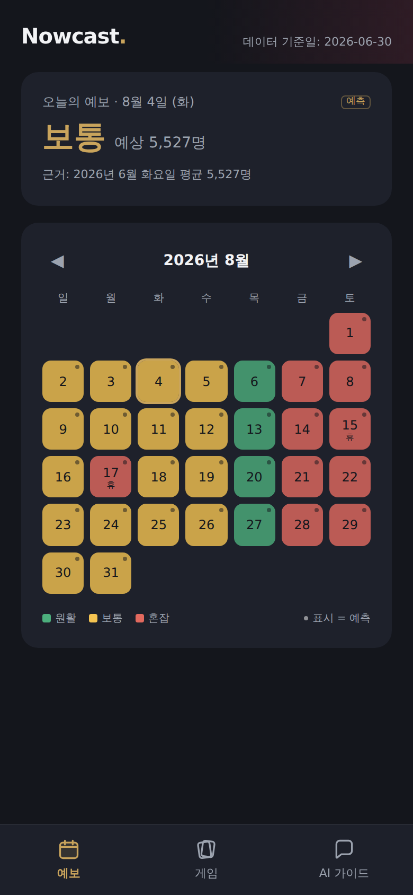

# Nowcast

> **초보자도 딸깍 한 번으로 확인하는 강원랜드 카지노 혼잡 예보 · AI 가이드 서비스**
> 강원랜드 × SDU-COSS 바이브코딩 캠프 · 팀 딸깍



**배포 URL: https://casinohack.vercel.app**

## 활용한 강원랜드 공공데이터셋 (공공데이터포털 · 제공기관 ㈜강원랜드)

- ㈜강원랜드_내국인 카지노 입장권 발행대비 출입현황 — 혼잡 예보(일자별 실입장) + 노쇼율 분석
- ㈜강원랜드_외국인 카지노 입장권 발행대비 출입현황 — 노쇼율 분석
- ㈜강원랜드_외국인 국가별 일일 카지노 입장현황 — 일자별 외국인 입장 합산 + 실시간 위젯(Open API)
- ㈜강원랜드_내국인 입장권 ARS/모바일 예약현황 — 예약 수요 참고
- ㈜강원랜드_외국인 입장권 ARS/모바일 예약현황 — 예약 수요 참고
- ㈜강원랜드_카지노게임현황 — 게임별 테이블·기기 수 (게임 추천 카드)

## 주요 기능

1. **혼잡 예보 캘린더** — 일자별 입장객 데이터로 (요일 × 공휴일 가중) 평균을 계산해 원활/보통/혼잡 3등급 히트맵 제공. 미래 날짜는 전부 `예측` 뱃지와 근거 문구("2026년 6월 토요일 평균 8,438명 × 공휴일 가중 1.37")를 함께 표시하고, 날짜를 탭하면 이 주의 추천 방문일을 알려줍니다.
2. **게임 추천** — 실제 게임현황 데이터의 테이블·기기 수 기준 "초보자가 앉기 쉬운 순" 정렬. 난이도 뱃지·좌석 게이지·게임별 진행 방법 요약(팀 편집본) 모달, 그리고 발행 대비 실입장 데이터 기반 노쇼율 방문 팁을 제공합니다.
3. **AI 가이드 챗봇 (Nowcast AI)** — 혼잡 예보·게임 좌석·규칙 요약·이용 절차를 컨텍스트로 답하는 첫 방문자 안내 도우미. 답변마다 "근거:"를 표기하고, 승률·배팅 전략 질문은 정중히 거절합니다. Anthropic API 키가 없거나 호출이 실패해도 스냅샷 데이터 기반 로컬 안내 모드로 동작합니다.

## 데이터 전략 (하이브리드)

원본 CSV를 `scripts/build_snapshot.ts`로 전처리한 `data/*.json` 스냅샷이 모든 화면의 기본 소스입니다. `/api/forecast`가 요청 시 공공데이터 Open API 최신분을 병합(24시간 캐시)하며, API 실패 시 조용히 스냅샷만 사용하므로 키가 없어도 전체 화면이 동작합니다.

## 기술 스택

Next.js 14 (App Router) · TypeScript · Tailwind CSS · Anthropic API (claude-sonnet-4-6) · Vercel

## 실행 방법

```bash
npm install
npm run dev        # http://localhost:3000
```

환경변수 (선택 — 없어도 스냅샷으로 전체 동작):

```bash
cp .env.example .env.local
```

| 이름 | 용도 |
|---|---|
| `ANTHROPIC_API_KEY` | AI 가이드 챗봇 (미설정 시 로컬 안내 모드) |
| `DATA_GO_KR_API_KEY` | 공공데이터포털 인증키 (실시간 외국인 위젯·최신분 병합) |
| `DATA_GO_KR_API_URL` | (선택) odcloud 요청주소 — 입장객 최신분 병합용 |

유용한 스크립트:

```bash
npm run snapshot   # data_raw/*.csv → data/*.json 재생성
npm run verify     # 예보 모델 등급 분포 콘솔 검증
```

## 팀 딸깍

"복잡한 준비 없이, 딸깍 한 번으로." 처음 방문하는 사람의 헛걸음과 대기를 줄이는 계획적 방문 도우미를 만듭니다.
